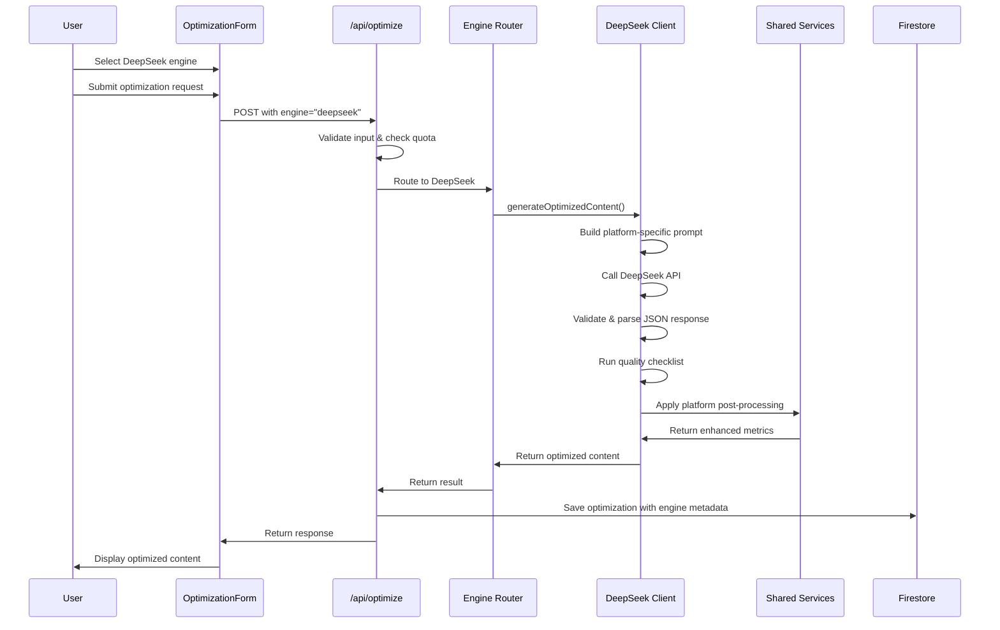

# Design Document: DeepSeek Optimization Engine Integration

## Overview

This design document specifies the architecture and implementation details for integrating DeepSeek AI as an alternative optimization engine into the OptiCommerce AI e-commerce listing optimizer. The integration follows a parallel architecture pattern, allowing users to choose between Gemini and DeepSeek while maintaining backward compatibility with existing functionality.

The DeepSeek integration introduces:
- A dedicated client module for DeepSeek API communication
- Engine selection UI component for user choice
- Platform-specific prompt templates optimized for DeepSeek
- JSON response validation and parsing
- Quality checklist validation for optimization output
- Comprehensive error handling and logging

The design maintains the existing service architecture (Platform Engines, SEO Optimizer, Compliance Checker, Quality Assurance) and extends it to support multiple AI providers.

## Architecture

### High-Level Architecture

```
┌─────────────────────────────────────────────────────────────┐
│                    Optimization Form UI                      │
│  ┌──────────────────────────────────────────────────────┐  │
│  │  Engine Selector: [ Gemini | DeepSeek ]             │  │
│  │  Platform: [Amazon ▼]                                │  │
│  │  Mode: [Optimize Existing ▼]                         │  │
│  └──────────────────────────────────────────────────────┘  │
└─────────────────────────────────────────────────────────────┘
                            │
                            ▼
┌─────────────────────────────────────────────────────────────┐
│              Optimization API Route Handler                  │
│  ┌──────────────────────────────────────────────────────┐  │
│  │  1. Validate input                                    │  │
│  │  2. Check user quota                                  │  │
│  │  3. Route to selected engine                          │  │
│  └──────────────────────────────────────────────────────┘  │
└─────────────────────────────────────────────────────────────┘
                            │
              ┌─────────────┴─────────────┐
              ▼                           ▼
┌──────────────────────────┐  ┌──────────────────────────┐
│   Gemini Client          │  │   DeepSeek Client        │
│  (Existing)              │  │   (New)                  │
│                          │  │                          │
│  - generateOptimized     │  │  - generateOptimized     │
│    Content()             │  │    Content()             │
│  - Enhanced optimization │  │  - Mode-specific prompts │
│                          │  │  - JSON validation       │
│                          │  │  - Quality checks        │
└──────────────────────────┘  └──────────────────────────┘
              │                           │
              └─────────────┬─────────────┘
                            ▼
┌─────────────────────────────────────────────────────────────┐
│              Shared Services Layer                           │
│  ┌──────────────────────────────────────────────────────┐  │
│  │  Platform Engines (Amazon, Shopify, eBay, etc.)     │  │
│  │  SEO Optimizer Service                                │  │
│  │  Compliance Checker Service                           │  │
│  │  Quality Assurance Service                            │  │
│  └──────────────────────────────────────────────────────┘  │
└─────────────────────────────────────────────────────────────┘
                            │
                            ▼
┌─────────────────────────────────────────────────────────────┐
│              Response Processing                             │
│  ┌──────────────────────────────────────────────────────┐  │
│  │  1. Calculate SEO metrics                             │  │
│  │  2. Generate compliance report                        │  │
│  │  3. Format response                                   │  │
│  │  4. Save to Firestore                                 │  │
│  └──────────────────────────────────────────────────────┘  │
└─────────────────────────────────────────────────────────────┘
```

### Component Interaction Flow



## Components and Interfaces

### 1. DeepSeek Client Module

**Location:** `src/lib/deepseek/client.ts`

**Purpose:** Handles all communication with the DeepSeek API, including prompt construction, API calls, response validation, and quality checking.

**Key Functions:**

```typescript
// Main optimization function
export async function generateOptimizedContent(
  title: string,
  description: string,
  platform: Platform,
  keywords?: string,
  mode: OptimizationMode = 'optimize_existing'
): Promise<DeepSeekOptimizedContent>

// Mode-specific prompt builders
function buildOptimizeExistingPrompt(
  title: string,
  description: string,
  platform: Platform,
  keywords?: string
): string

function buildCreateNewPrompt(
  productData: NewProductData
): string

function buildAnalyzeUrlPrompt(
  url: string,
  platform: Platform
): string

// Response validation
function validateDeepSeekResponse(
  response: any
): ValidationResult

// Quality checklist validation
function validateQualityChecklist(
  content: DeepSeekOptimizedContent,
  platform: Platform
): QualityCheckResult

// JSON extraction from markdown
function extractJsonFromResponse(
  text: string
): any
```

**Configuration:**

```typescript
interface DeepSeekConfig {
  apiKey: string;
  model: string; // default: "deepseek-chat"
  temperature: number; // default: 0.7
  max_tokens: number; // default: 4000
  top_p: number; // default: 0.95
  frequency_penalty: number; // default: 0.3
  presence_penalty: number; // default: 0.1
  response_format: { type: 'json_object' };
}
```

### 2. Engine Selection Component

**Location:** `src/components/dashboard/EngineSelector.tsx`

**Purpose:** UI component allowing users to select between Gemini and DeepSeek optimization engines.

**Interface:**

```typescript
interface EngineSelectorProps {
  selectedEngine: 'gemini' | 'deepseek';
  onEngineChange: (engine: 'gemini' | 'deepseek') => void;
  disabled?: boolean;
}

export default function EngineSelector({
  selectedEngine,
  onEngineChange,
  disabled = false
}: EngineSelectorProps): JSX.Element
```

**UI Design:**
- Radio button group or toggle switch
- Display engine capabilities/features
- Show engine status (available/unavailable)
- Persist selection in session storage

### 3. Optimization API Route Enhancement

**Location:** `src/app/api/optimize/route.ts`

**Modifications:**
- Add `engine` parameter to request body (optional, defaults to 'gemini')
- Route requests to appropriate client based on engine selection
- Save engine metadata to Firestore optimization records
- Handle engine-specific errors

**Enhanced Request Interface:**

```typescript
interface OptimizationRequest {
  mode: 'optimize_existing' | 'create_new' | 'analyze_url';
  engine?: 'gemini' | 'deepseek'; // New field
  
  // For optimize_existing mode
  title?: string;
  description?: string;
  platform: Platform;
  keywords?: string;
  
  // For create_new mode
  productData?: NewProductData;
  
  // For analyze_url mode
  url?: string;
}
```

### 4. Prompt Templates Module

**Location:** `src/lib/deepseek/prompts.ts`

**Purpose:** Contains all DeepSeek-specific prompt templates for different platforms and modes.

**Structure:**

```typescript
// System prompt defining AI role
export const DEEPSEEK_SYSTEM_PROMPT = `You are an expert e-commerce copywriter...`;

// Platform-specific rules
export const PLATFORM_RULES: Record<Platform, PlatformRules> = {
  amazon: {
    titleLimit: { min: 150, max: 200 },
    descriptionLimit: { min: 1500, max: 2000 },
    bulletLimit: { min: 400, max: 500 },
    keywordCount: { min: 40, max: 60 },
    bannedWords: [...],
    requiredElements: [...]
  },
  // ... other platforms
};

// Quality checklist template
export const QUALITY_CHECKLIST = {
  titleCharUtilization: 0.9, // 90%+
  bulletCharRange: { min: 400, max: 500 },
  descriptionCharRange: { min: 1500, max: 2000 },
  keywordCount: { min: 40, max: 60 },
  keywordDensity: { min: 0.01, max: 0.02 } // 1-2%
};

// Mode-specific prompt templates
export function getOptimizeExistingTemplate(
  platform: Platform
): string

export function getCreateNewTemplate(
  platform: Platform
): string

export function getAnalyzeUrlTemplate(
  platform: Platform
): string
```

### 5. Response Validation Module

**Location:** `src/lib/deepseek/validation.ts`

**Purpose:** Validates DeepSeek API responses for structure, completeness, and quality.

**Key Functions:**

```typescript
// Validate JSON structure
export function validateResponseStructure(
  response: any
): { valid: boolean; errors: string[] }

// Validate required fields
export function validateRequiredFields(
  response: any
): { valid: boolean; missing: string[] }

// Validate field types and ranges
export function validateFieldTypes(
  response: any
): { valid: boolean; errors: ValidationError[] }

// Run quality checklist
export function runQualityChecklist(
  content: DeepSeekOptimizedContent,
  platform: Platform
): QualityCheckResult

// Calculate keyword density
export function calculateKeywordDensity(
  text: string,
  keywords: string[]
): number
```

### 6. OptimizationForm Enhancement

**Location:** `src/components/dashboard/OptimizationForm.tsx`

**Modifications:**
- Add EngineSelector component
- Store engine selection in component state
- Pass engine parameter to API call
- Display engine-specific loading states

## Data Models

### DeepSeek Request

```typescript
interface DeepSeekRequest {
  model: string;
  messages: Array<{
    role: 'system' | 'user';
    content: string;
  }>;
  temperature: number;
  max_tokens: number;
  top_p: number;
  frequency_penalty: number;
  presence_penalty: number;
  response_format: { type: 'json_object' };
}
```

### DeepSeek Response

```typescript
interface DeepSeekResponse {
  id: string;
  object: string;
  created: number;
  model: string;
  choices: Array<{
    index: number;
    message: {
      role: string;
      content: string; // JSON string
    };
    finish_reason: string;
  }>;
  usage: {
    prompt_tokens: number;
    completion_tokens: number;
    total_tokens: number;
  };
}
```

### DeepSeek Optimized Content

```typescript
interface DeepSeekOptimizedContent {
  seoScore: number; // 0-100
  title: string;
  bullets: string[]; // Array of bullet points
  description: string;
  keywords: string[]; // 40-60 keywords
  recommendations: string[]; // Improvement suggestions
  
  // Additional metadata
  platform: Platform;
  mode: OptimizationMode;
  qualityChecks: QualityCheckResult;
  characterUtilization: {
    title: number; // percentage
    bullets: number; // total chars
    description: number; // total chars
  };
  keywordDensity: number; // percentage
}
```

### Quality Check Result

```typescript
interface QualityCheckResult {
  passed: boolean;
  score: number; // 0-100
  checks: {
    titleCharUtilization: {
      passed: boolean;
      actual: number;
      required: number;
      message: string;
    };
    bulletCharCount: {
      passed: boolean;
      actual: number;
      range: { min: number; max: number };
      message: string;
    };
    descriptionCharCount: {
      passed: boolean;
      actual: number;
      range: { min: number; max: number };
      message: string;
    };
    keywordCount: {
      passed: boolean;
      actual: number;
      range: { min: number; max: number };
      message: string;
    };
    keywordDensity: {
      passed: boolean;
      actual: number;
      range: { min: number; max: number };
      message: string;
    };
  };
  warnings: string[];
  suggestions: string[];
}
```

### New Product Data

```typescript
interface NewProductData {
  platform: Platform;
  productName: string;
  whatIsIt: string; // Brief description
  problemSolved?: string;
  keyFeatures: string[]; // 3-5 features
  mainBenefits: string[]; // 3-5 benefits
  primaryMaterial?: string;
  idealCustomer?: string;
  useCases: string[]; // 2-4 use cases
  uniqueAdvantage?: string;
  category?: string;
  tone?: 'professional' | 'casual' | 'technical' | 'friendly';
}
```

### Optimization Mode

```typescript
type OptimizationMode = 'optimize_existing' | 'create_new' | 'analyze_url';
```

### Enhanced Optimization Record

```typescript
interface OptimizationRecord extends Optimization {
  engine: 'gemini' | 'deepseek'; // New field
  mode: OptimizationMode; // New field
  qualityMetrics?: QualityCheckResult; // New field for DeepSeek
  apiMetadata?: {
    model: string;
    tokensUsed: number;
    responseTime: number;
  };
}
```

## Error Handling

### Error Types

```typescript
enum DeepSeekErrorCode {
  API_KEY_MISSING = 'DEEPSEEK_API_KEY_MISSING',
  API_KEY_INVALID = 'DEEPSEEK_API_KEY_INVALID',
  API_UNAVAILABLE = 'DEEPSEEK_API_UNAVAILABLE',
  QUOTA_EXCEEDED = 'DEEPSEEK_QUOTA_EXCEEDED',
  INVALID_RESPONSE = 'DEEPSEEK_INVALID_RESPONSE',
  JSON_PARSE_ERROR = 'DEEPSEEK_JSON_PARSE_ERROR',
  VALIDATION_FAILED = 'DEEPSEEK_VALIDATION_FAILED',
  NETWORK_ERROR = 'DEEPSEEK_NETWORK_ERROR',
  TIMEOUT = 'DEEPSEEK_TIMEOUT'
}

interface DeepSeekError extends Error {
  code: DeepSeekErrorCode;
  details?: any;
  recoverable: boolean;
}
```

### Error Handling Strategy

1. **API Key Errors:**
   - Check for DEEPSEEK_API_KEY on initialization
   - Throw descriptive error if missing
   - Log API key validation errors
   - Do not fall back to Gemini (user explicitly selected DeepSeek)

2. **API Unavailability:**
   - Retry with exponential backoff (3 attempts)
   - Timeout after 30 seconds per request
   - Return clear error message to user
   - Log full error details for debugging

3. **JSON Parsing Errors:**
   - First attempt: Parse response directly
   - Second attempt: Extract JSON from markdown code blocks
   - Third attempt: Extract JSON using regex patterns
   - If all fail: Return structured error with raw response

4. **Validation Errors:**
   - Log validation failures with details
   - Return partial results if possible
   - Include specific validation errors in response
   - Suggest corrections to user

5. **Quota Exceeded:**
   - Return specific quota error
   - Include information about limits
   - Suggest upgrade or alternative engine

### Error Response Format

```typescript
interface ErrorResponse {
  success: false;
  error: string; // User-friendly message
  code: DeepSeekErrorCode;
  details?: {
    field?: string;
    expected?: any;
    actual?: any;
    suggestions?: string[];
  };
  recoverable: boolean;
  fallbackAvailable: boolean; // Always false for DeepSeek
}
```

## Testing Strategy

### Unit Testing

**Test Coverage Areas:**
1. DeepSeek client initialization and configuration
2. Prompt template generation for each platform
3. JSON response parsing and extraction
4. Quality checklist validation logic
5. Keyword density calculation
6. Character utilization calculation
7. Error handling for each error type
8. Engine selection component rendering
9. API route engine routing logic

**Example Unit Tests:**

```typescript
describe('DeepSeek Client', () => {
  describe('Configuration', () => {
    it('should throw error when API key is missing', () => {
      delete process.env.DEEPSEEK_API_KEY;
      expect(() => new DeepSeekClient()).toThrow('DEEPSEEK_API_KEY_MISSING');
    });
    
    it('should use default configuration values', () => {
      const client = new DeepSeekClient();
      expect(client.config.temperature).toBe(0.7);
      expect(client.config.max_tokens).toBe(4000);
    });
  });
  
  describe('JSON Extraction', () => {
    it('should extract JSON from markdown code blocks', () => {
      const response = '```json\n{"title": "Test"}\n```';
      const result = extractJsonFromResponse(response);
      expect(result).toEqual({ title: 'Test' });
    });
    
    it('should handle plain JSON responses', () => {
      const response = '{"title": "Test"}';
      const result = extractJsonFromResponse(response);
      expect(result).toEqual({ title: 'Test' });
    });
  });
  
  describe('Quality Checklist', () => {
    it('should validate title character utilization', () => {
      const content = {
        title: 'A'.repeat(180), // 90% of 200
        platform: 'amazon'
      };
      const result = validateQualityChecklist(content, 'amazon');
      expect(result.checks.titleCharUtilization.passed).toBe(true);
    });
    
    it('should fail when title is too short', () => {
      const content = {
        title: 'Short Title',
        platform: 'amazon'
      };
      const result = validateQualityChecklist(content, 'amazon');
      expect(result.checks.titleCharUtilization.passed).toBe(false);
    });
  });
});
```

### Integration Testing

**Test Scenarios:**
1. End-to-end optimization flow with DeepSeek
2. Engine switching between Gemini and DeepSeek
3. API route handling for both engines
4. Firestore saving with engine metadata
5. Error handling and user feedback
6. Quality checklist validation with real responses

**Example Integration Test:**

```typescript
describe('Optimization API with DeepSeek', () => {
  it('should optimize content using DeepSeek engine', async () => {
    const request = {
      engine: 'deepseek',
      mode: 'optimize_existing',
      title: 'Test Product',
      description: 'Test description',
      platform: 'amazon',
      keywords: 'test, product'
    };
    
    const response = await fetch('/api/optimize', {
      method: 'POST',
      headers: {
        'Content-Type': 'application/json',
        'Authorization': `Bearer ${testToken}`
      },
      body: JSON.stringify(request)
    });
    
    const result = await response.json();
    
    expect(result.success).toBe(true);
    expect(result.data.optimized.title).toBeDefined();
    expect(result.data.optimized.seoScore).toBeGreaterThan(0);
    expect(result.data.optimized.qualityChecks).toBeDefined();
  });
  
  it('should save optimization with engine metadata', async () => {
    // ... perform optimization ...
    
    const savedDoc = await adminDb
      .collection('optimizations')
      .where('userId', '==', testUserId)
      .orderBy('createdAt', 'desc')
      .limit(1)
      .get();
    
    const data = savedDoc.docs[0].data();
    expect(data.engine).toBe('deepseek');
    expect(data.mode).toBe('optimize_existing');
  });
});
```

### Property-Based Testing

Property-based tests will be defined after completing the prework analysis in the next section.


## Correctness Properties

*A property is a characteristic or behavior that should hold true across all valid executions of a system—essentially, a formal statement about what the system should do. Properties serve as the bridge between human-readable specifications and machine-verifiable correctness guarantees.*

### Property 1: API Interface Compatibility

*For any* optimization request (title, description, platform, keywords), both DeepSeek and Gemini clients should accept the same input parameters and return compatible output structures.

**Validates: Requirements 1.1**

### Property 2: Model Configuration Inclusion

*For any* API request made by the DeepSeek client, the request payload should contain all required configuration parameters (temperature, max_tokens, top_p, frequency_penalty, presence_penalty).

**Validates: Requirements 1.3**

### Property 3: JSON Response Format Specification

*For any* API request made by the DeepSeek client, the request should specify response_format as { type: 'json_object' }.

**Validates: Requirements 1.4**

### Property 4: Engine Selection Persistence

*For any* engine selection made by a user, retrieving the selection later in the same session should return the same engine choice.

**Validates: Requirements 2.3**

### Property 5: Selected Engine Usage

*For any* engine selection and subsequent optimization request, the system should invoke the selected engine (not a different one).

**Validates: Requirements 2.4**

### Property 6: Platform Rules in System Prompt

*For all* supported platforms (Amazon, Shopify, eBay, Etsy, Walmart, WooCommerce), the system prompt should include platform-specific character limits and rules.

**Validates: Requirements 3.2, 3.6**

### Property 7: Mode-Specific Prompt Generation

*For any* optimization mode (optimize_existing, create_new, analyze_url), the DeepSeek client should generate a prompt specific to that mode.

**Validates: Requirements 4.4**

### Property 8: Consistent Response Structure Across Modes

*For any* optimization mode and any valid input, the DeepSeek response should contain the same JSON structure (seoScore, title, bullets, description, keywords, recommendations).

**Validates: Requirements 4.5**

### Property 9: Platform Title Length Validation

*For any* platform and any generated title, the title length should not exceed the platform-specific character limit.

**Validates: Requirements 5.7**

### Property 10: Platform Description Length Validation

*For any* platform and any generated description, the description length should meet or exceed the platform-specific minimum length requirement.

**Validates: Requirements 5.8**

### Property 11: Response Structure Validation

*For any* response from DeepSeek, the system should validate that it contains valid JSON structure before processing.

**Validates: Requirements 6.1**

### Property 12: Required Fields Presence

*For any* valid DeepSeek response, it should contain all required fields: seoScore, title, bullets, description, keywords, and recommendations.

**Validates: Requirements 6.2**

### Property 13: SEO Score Range Validation

*For any* DeepSeek response, the seoScore field should be a number between 0 and 100 (inclusive).

**Validates: Requirements 6.5**

### Property 14: Bullets Array Type Validation

*For any* DeepSeek response, the bullets field should be an array where every element is a string.

**Validates: Requirements 6.6**

### Property 15: Keywords Array Type Validation

*For any* DeepSeek response, the keywords field should be an array where every element is a string.

**Validates: Requirements 6.7**

### Property 16: Title Character Utilization

*For any* optimized content and its target platform, the title should use at least 90% of the platform's maximum character limit.

**Validates: Requirements 7.1**

### Property 17: Bullet Points Character Range

*For any* optimized content, the total character count of all bullet points combined should be between 400 and 500 characters.

**Validates: Requirements 7.2**

### Property 18: Description Character Range

*For any* optimized content, the description should be between 1500 and 2000 characters in length.

**Validates: Requirements 7.3**

### Property 19: Keyword Count Range

*For any* optimized content, the number of keywords should be between 40 and 60 (inclusive).

**Validates: Requirements 7.4**

### Property 20: Keyword Density Range

*For any* optimized content, the calculated keyword density should be between 1% and 2% (0.01 to 0.02).

**Validates: Requirements 7.5**

### Property 21: Quality Validation Warnings

*For any* quality validation that fails one or more checks, the response should include warnings describing the failures.

**Validates: Requirements 7.6**

### Property 22: Specific Quality Feedback

*For any* failed quality check, the response should include specific feedback identifying which criterion was not met and the actual vs. expected values.

**Validates: Requirements 7.7**

### Property 23: Gemini Backward Compatibility

*For any* optimization request using Gemini engine, the system should produce the same results as before the DeepSeek integration.

**Validates: Requirements 8.2**

### Property 24: Gemini Mode Support

*For all* optimization modes (optimize_existing, create_new, analyze_url), the Gemini engine should continue to function correctly.

**Validates: Requirements 8.3**

### Property 25: Engine Switch Data Preservation

*For any* sequence of engine switches (Gemini → DeepSeek → Gemini or vice versa), user input data should be preserved without loss.

**Validates: Requirements 8.5**

### Property 26: API Error Logging

*For any* error returned by the DeepSeek API, the system should log the error details (code, message, timestamp).

**Validates: Requirements 9.2**

### Property 27: No Automatic Fallback

*For any* DeepSeek error when DeepSeek is explicitly selected, the system should not automatically fall back to using Gemini.

**Validates: Requirements 9.6**

### Property 28: Configuration Value Range Validation

*For any* configuration parameter (temperature, max_tokens, top_p, frequency_penalty, presence_penalty), the system should validate that the value is within the acceptable range for that parameter.

**Validates: Requirements 10.7**

### Property 29: SEO Score Presence

*For any* DeepSeek response, an SEO score should be calculated and included in the response.

**Validates: Requirements 11.1**

### Property 30: Recommendations Presence

*For any* DeepSeek response, a recommendations array with improvement suggestions should be included.

**Validates: Requirements 11.2**

### Property 31: Keyword Analysis Presence

*For any* DeepSeek response, keyword analysis data (primary and related keywords) should be included.

**Validates: Requirements 11.3**

### Property 32: Compliance Status Presence

*For any* DeepSeek response, compliance status indicating platform rule adherence should be included.

**Validates: Requirements 11.4**

### Property 33: Keyword Density Calculation

*For any* optimized content with keywords, the system should calculate and return the keyword density as a percentage.

**Validates: Requirements 11.5**

### Property 34: Character Utilization Calculation

*For any* optimized content, the system should calculate and return the character utilization percentage for the title.

**Validates: Requirements 11.6**

### Property 35: Quality Metrics Breakdown

*For any* DeepSeek response, a breakdown of quality metrics (title score, description score, keyword relevance) should be provided.

**Validates: Requirements 11.7**

### Property 36: Platform Engine Integration

*For any* platform engine (Amazon, Shopify, eBay, Etsy, Walmart, WooCommerce), the DeepSeek client should be able to work with it to apply platform-specific rules.

**Validates: Requirements 12.1**

### Property 37: Platform Post-Processing

*For any* DeepSeek response and any target platform, platform-specific post-processing should be applied to the content.

**Validates: Requirements 12.2**

### Property 38: SEO Service Integration

*For any* DeepSeek optimization, the existing SEO scoring service should be used to calculate the final SEO score.

**Validates: Requirements 12.3**

### Property 39: Compliance Service Integration

*For any* DeepSeek optimization, the existing compliance checking service should be used to validate the output.

**Validates: Requirements 12.4**

### Property 40: Firestore Persistence with Metadata

*For any* DeepSeek optimization, when saved to Firestore, the record should include engine metadata indicating "deepseek" was used.

**Validates: Requirements 12.5, 12.6**

### Property 41: JSON Extraction from Markdown

*For any* response text containing JSON within markdown code blocks (```json...```), the extraction function should successfully parse and return the JSON object.

**Validates: Requirements 6.4 (edge case handling)**


## Testing Strategy

### Dual Testing Approach

This feature requires both unit tests and property-based tests to ensure comprehensive coverage:

- **Unit tests** validate specific examples, edge cases, and error conditions
- **Property tests** verify universal properties across all inputs
- Together, they provide comprehensive coverage where unit tests catch concrete bugs and property tests verify general correctness

### Unit Testing Focus Areas

Unit tests should focus on:

1. **Specific Examples:**
   - DeepSeek client initialization with valid API key
   - Engine selector rendering with both options
   - Default engine selection (Gemini)
   - Specific platform character limits (Amazon: 150-200, Shopify: 60-70, etc.)
   - System prompt contains required sections
   - Configuration parameter defaults (temperature: 0.7, max_tokens: 4000, etc.)
   - Mode-specific function signatures (optimize_existing, create_new, analyze_url)

2. **Edge Cases:**
   - Missing API key throws descriptive error
   - Invalid API key throws descriptive error
   - API unavailable returns error message
   - Quota exceeded returns specific error
   - Invalid JSON triggers markdown extraction
   - Missing required fields returns error
   - All parsing attempts fail returns structured error

3. **Integration Points:**
   - API route correctly routes to selected engine
   - Firestore saves include engine metadata
   - Platform engines work with DeepSeek responses
   - SEO scoring service integrates correctly
   - Compliance checking service integrates correctly

### Property-Based Testing Configuration

**Library Selection:** Use `fast-check` for TypeScript/JavaScript property-based testing

**Test Configuration:**
- Minimum 100 iterations per property test
- Each test must reference its design document property
- Tag format: `Feature: deepseek-optimization-engine, Property {number}: {property_text}`

**Property Test Implementation:**

Each correctness property (1-41) should be implemented as a single property-based test. Examples:

```typescript
import fc from 'fast-check';

// Feature: deepseek-optimization-engine, Property 1: API Interface Compatibility
describe('Property 1: API Interface Compatibility', () => {
  it('should accept same inputs for both engines', () => {
    fc.assert(
      fc.property(
        fc.string({ minLength: 10 }), // title
        fc.string({ minLength: 50 }), // description
        fc.constantFrom('amazon', 'shopify', 'etsy', 'ebay', 'walmart'), // platform
        fc.option(fc.string()), // keywords
        async (title, description, platform, keywords) => {
          // Both clients should accept the same parameters
          const geminiParams = { title, description, platform, keywords };
          const deepseekParams = { title, description, platform, keywords };
          
          // Verify both have compatible interfaces
          expect(() => validateGeminiInput(geminiParams)).not.toThrow();
          expect(() => validateDeepSeekInput(deepseekParams)).not.toThrow();
        }
      ),
      { numRuns: 100 }
    );
  });
});

// Feature: deepseek-optimization-engine, Property 8: Consistent Response Structure Across Modes
describe('Property 8: Consistent Response Structure', () => {
  it('should return same structure for all modes', () => {
    fc.assert(
      fc.property(
        fc.constantFrom('optimize_existing', 'create_new', 'analyze_url'),
        fc.record({
          title: fc.string({ minLength: 10 }),
          description: fc.string({ minLength: 50 }),
          platform: fc.constantFrom('amazon', 'shopify', 'etsy', 'ebay', 'walmart')
        }),
        async (mode, input) => {
          const response = await mockDeepSeekOptimize(input, mode);
          
          // All modes should return same structure
          expect(response).toHaveProperty('seoScore');
          expect(response).toHaveProperty('title');
          expect(response).toHaveProperty('bullets');
          expect(response).toHaveProperty('description');
          expect(response).toHaveProperty('keywords');
          expect(response).toHaveProperty('recommendations');
        }
      ),
      { numRuns: 100 }
    );
  });
});

// Feature: deepseek-optimization-engine, Property 13: SEO Score Range Validation
describe('Property 13: SEO Score Range', () => {
  it('should have seoScore between 0 and 100', () => {
    fc.assert(
      fc.property(
        fc.record({
          seoScore: fc.integer(),
          title: fc.string(),
          bullets: fc.array(fc.string()),
          description: fc.string(),
          keywords: fc.array(fc.string()),
          recommendations: fc.array(fc.string())
        }),
        (response) => {
          const validation = validateDeepSeekResponse(response);
          
          if (validation.valid) {
            expect(response.seoScore).toBeGreaterThanOrEqual(0);
            expect(response.seoScore).toBeLessThanOrEqual(100);
          }
        }
      ),
      { numRuns: 100 }
    );
  });
});

// Feature: deepseek-optimization-engine, Property 20: Keyword Density Range
describe('Property 20: Keyword Density Range', () => {
  it('should calculate density between 1% and 2%', () => {
    fc.assert(
      fc.property(
        fc.string({ minLength: 1000, maxLength: 2000 }), // description
        fc.array(fc.string({ minLength: 3, maxLength: 15 }), { minLength: 40, maxLength: 60 }), // keywords
        (description, keywords) => {
          const density = calculateKeywordDensity(description, keywords);
          
          // Should be between 0.01 and 0.02 (1% to 2%)
          expect(density).toBeGreaterThanOrEqual(0.01);
          expect(density).toBeLessThanOrEqual(0.02);
        }
      ),
      { numRuns: 100 }
    );
  });
});

// Feature: deepseek-optimization-engine, Property 41: JSON Extraction from Markdown
describe('Property 41: JSON Extraction from Markdown', () => {
  it('should extract JSON from markdown code blocks', () => {
    fc.assert(
      fc.property(
        fc.jsonValue(), // any valid JSON value
        (jsonObj) => {
          const jsonString = JSON.stringify(jsonObj);
          const markdownWrapped = `\`\`\`json\n${jsonString}\n\`\`\``;
          
          const extracted = extractJsonFromResponse(markdownWrapped);
          expect(extracted).toEqual(jsonObj);
        }
      ),
      { numRuns: 100 }
    );
  });
});
```

### Test Data Generators

For property-based testing, create custom generators:

```typescript
// Generator for valid optimization inputs
const optimizationInputGen = fc.record({
  title: fc.string({ minLength: 10, maxLength: 200 }),
  description: fc.string({ minLength: 50, maxLength: 5000 }),
  platform: fc.constantFrom('amazon', 'shopify', 'etsy', 'ebay', 'walmart', 'woocommerce'),
  keywords: fc.option(fc.array(fc.string({ minLength: 3, maxLength: 20 }), { maxLength: 10 }).map(arr => arr.join(', ')))
});

// Generator for valid DeepSeek responses
const deepseekResponseGen = fc.record({
  seoScore: fc.integer({ min: 0, max: 100 }),
  title: fc.string({ minLength: 50, maxLength: 200 }),
  bullets: fc.array(fc.string({ minLength: 50, maxLength: 150 }), { minLength: 3, maxLength: 7 }),
  description: fc.string({ minLength: 1500, maxLength: 2000 }),
  keywords: fc.array(fc.string({ minLength: 3, maxLength: 20 }), { minLength: 40, maxLength: 60 }),
  recommendations: fc.array(fc.string({ minLength: 20, maxLength: 100 }), { minLength: 3, maxLength: 10 })
});

// Generator for platform-specific configurations
const platformConfigGen = (platform: Platform) => {
  const limits = getPlatformLimits(platform);
  return fc.record({
    titleMaxLength: fc.constant(limits.titleMax),
    titleMinLength: fc.constant(limits.titleMin),
    descriptionMinLength: fc.constant(limits.descriptionMin)
  });
};
```

### Testing Priorities

**High Priority (Must Test):**
1. API interface compatibility (Property 1)
2. Response structure validation (Properties 11, 12)
3. Platform character limits (Properties 9, 10)
4. Quality checklist validation (Properties 16-20)
5. Engine selection and usage (Properties 4, 5)
6. Backward compatibility (Properties 23, 24)
7. JSON extraction (Property 41)

**Medium Priority (Should Test):**
1. Configuration validation (Property 28)
2. Error handling and logging (Properties 26, 27)
3. Service integration (Properties 38, 39, 40)
4. Response metadata (Properties 29-35)

**Lower Priority (Nice to Test):**
1. Prompt template generation (Properties 6, 7)
2. Mode-specific behavior (Property 8)
3. UI component rendering (examples from requirements 2.1, 2.2)

### Continuous Integration

Property-based tests should run:
- On every pull request
- Before merging to main branch
- As part of nightly test suite with increased iterations (500+)
- When DeepSeek client code is modified

### Test Coverage Goals

- Unit test coverage: 85%+ for DeepSeek client module
- Property test coverage: All 41 properties implemented
- Integration test coverage: All API routes and service integrations
- Edge case coverage: All error conditions tested

### Manual Testing Checklist

Before release, manually verify:
- [ ] Engine selector appears in UI
- [ ] Switching engines preserves form data
- [ ] DeepSeek optimizations save to Firestore with correct metadata
- [ ] Error messages are user-friendly
- [ ] Quality warnings display correctly
- [ ] All platforms work with DeepSeek
- [ ] Gemini still works after integration
- [ ] API key configuration works correctly
