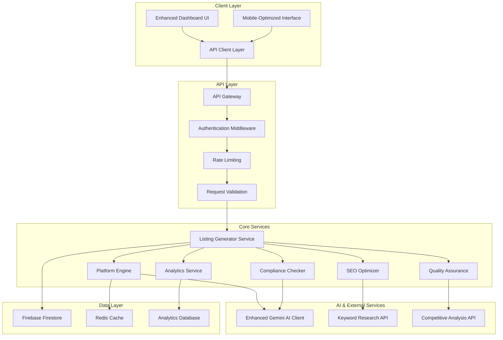

# Design Document

## Overview

This design document outlines the transformation of the existing OptiCommerce AI application into a comprehensive, expert-level multi-platform e-commerce listing optimizer. The enhanced system will integrate advanced AI capabilities, platform-specific optimization engines, and professional-grade features while maintaining the existing Next.js architecture and Firebase integration.

The design leverages the current foundation of Gemini AI integration, Firebase authentication, and React-based UI components, extending them with sophisticated listing generation capabilities that reflect 15+ years of e-commerce expertise.

## Architecture

### High-Level System Architecture



### Enhanced Component Architecture

The system extends the existing component structure with new specialized modules:

1. **Enhanced AI Engine**: Upgraded Gemini AI client with platform-specific prompts and expert-level optimization logic
2. **Platform Engine**: New service handling platform-specific requirements, formatting, and compliance rules
3. **SEO Optimizer**: Advanced keyword research, integration, and ranking factor optimization
4. **Compliance Checker**: Automated validation against platform policies and prohibited content
5. **Quality Assurance**: Comprehensive quality checks and improvement recommendations
6. **Analytics Service**: Performance tracking, optimization metrics, and competitive analysis

## Components and Interfaces

### 1. Enhanced Listing Generator Service

**Location**: `src/lib/services/ListingGeneratorService.ts`

**Purpose**: Central orchestrator for the listing optimization process, coordinating between all specialized services.

**Key Methods**:
```typescript
interface ListingGeneratorService {
  generateOptimizedListing(input: EnhancedOptimizationInput): Promise<ComprehensiveListing>
  bulkOptimize(inputs: EnhancedOptimizationInput[]): Promise<ComprehensiveListing[]>
  validateListing(listing: ComprehensiveListing, platform: Platform): Promise<ValidationResult>
  getOptimizationRecommendations(listing: ComprehensiveListing): Promise<RecommendationSet>
}
```

**Integration Points**:
- Receives requests from API endpoints
- Coordinates with Platform Engine for platform-specific processing
- Utilizes SEO Optimizer for keyword research and integration
- Employs Compliance Checker for policy validation
- Uses Quality Assurance for final validation

### 2. Platform Engine

**Location**: `src/lib/engines/PlatformEngine.ts`

**Purpose**: Handles platform-specific optimization logic, formatting requirements, and algorithm-specific optimizations.

**Key Methods**:
```typescript
interface PlatformEngine {
  optimizeForPlatform(content: BaseContent, platform: Platform): Promise<PlatformOptimizedContent>
  validatePlatformCompliance(content: PlatformOptimizedContent, platform: Platform): Promise<ComplianceResult>
  getAlgorithmFactors(platform: Platform): AlgorithmFactors
  formatForPlatform(content: OptimizedContent, platform: Platform): Promise<FormattedListing>
}
```

**Platform-Specific Implementations**:
- **Amazon Engine**: A9/A10 algorithm optimization, 200-char titles, bullet points, backend search terms
- **eBay Engine**: Cassini algorithm optimization, 80-char titles, item specifics, competitive pricing focus
- **Etsy Engine**: Handmade/vintage focus, 140-char titles, 13 tags, quality score optimization
- **Shopify Engine**: Google SEO optimization, unlimited descriptions, variant management
- **Walmart Engine**: 75-char titles, competitive pricing, product attributes

### 3. Enhanced SEO Optimizer

**Location**: `src/lib/optimizers/SEOOptimizer.ts`

**Purpose**: Advanced keyword research, natural integration, and search ranking optimization.

**Key Methods**:
```typescript
interface SEOOptimizer {
  researchKeywords(productInfo: ProductInfo, platform: Platform): Promise<KeywordSet>
  integrateKeywords(content: BaseContent, keywords: KeywordSet): Promise<KeywordOptimizedContent>
  calculateSEOScore(content: OptimizedContent, platform: Platform): Promise<SEOScore>
  generateBackendSearchTerms(keywords: KeywordSet, platform: Platform): Promise<string[]>
  analyzeCompetitorKeywords(productCategory: string, platform: Platform): Promise<CompetitorKeywords>
}
```

**Advanced Features**:
- Long-tail keyword generation
- Semantic keyword analysis
- Competitor keyword analysis
- Search volume and competition assessment
- Natural language integration algorithms

### 4. Compliance Checker

**Location**: `src/lib/validators/ComplianceChecker.ts`

**Purpose**: Automated validation against platform policies, prohibited content detection, and compliance recommendations.

**Key Methods**:
```typescript
interface ComplianceChecker {
  validateContent(content: OptimizedContent, platform: Platform): Promise<ComplianceResult>
  checkProhibitedWords(text: string, platform: Platform): Promise<ProhibitedWordResult>
  validateTitleCompliance(title: string, platform: Platform): Promise<TitleComplianceResult>
  checkPolicyCompliance(listing: ComprehensiveListing, platform: Platform): Promise<PolicyComplianceResult>
  generateComplianceRecommendations(violations: ComplianceViolation[]): Promise<ComplianceRecommendation[]>
}
```

**Compliance Rules**:
- Platform-specific prohibited words and phrases
- Title formatting requirements
- Description content restrictions
- Image and media compliance
- Category-specific restrictions

### 5. Quality Assurance Service

**Location**: `src/lib/services/QualityAssuranceService.ts`

**Purpose**: Comprehensive quality validation, improvement recommendations, and professional standards enforcement.

**Key Methods**:
```typescript
interface QualityAssuranceService {
  validateQuality(listing: ComprehensiveListing): Promise<QualityReport>
  checkGrammarAndSpelling(text: string): Promise<GrammarCheckResult>
  validateMobileOptimization(listing: ComprehensiveListing): Promise<MobileOptimizationResult>
  generateImprovementRecommendations(qualityReport: QualityReport): Promise<ImprovementRecommendation[]>
  calculateQualityScore(listing: ComprehensiveListing): Promise<QualityScore>
}
```

### 6. Enhanced API Endpoints

**Enhanced Optimization Endpoint**: `src/app/api/optimize/route.ts`
- Extended to support comprehensive listing generation
- Platform-specific optimization routing
- Bulk optimization capabilities
- Advanced error handling and validation

**New Bulk Optimization Endpoint**: `src/app/api/bulk-optimize/route.ts`
- Handles multiple product optimizations simultaneously
- Progress tracking and status updates
- Batch processing with rate limiting

**Validation Endpoint**: `src/app/api/validate/route.ts`
- Standalone listing validation service
- Compliance checking without optimization
- Quality assessment and recommendations

**Analytics Endpoint**: `src/app/api/analytics/route.ts`
- Optimization performance tracking
- Usage analytics and insights
- Competitive analysis data

### 7. Enhanced UI Components

**Platform Selector Component**: `src/components/dashboard/PlatformSelector.tsx`
- Visual platform selection with icons and descriptions
- Real-time requirement display
- Platform-specific tips and guidelines

**Advanced Optimization Form**: `src/components/dashboard/AdvancedOptimizationForm.tsx`
- Multi-step form with progressive disclosure
- Real-time validation and character counting
- Platform-specific field customization
- Bulk upload capabilities

**Comprehensive Results Display**: `src/components/dashboard/ComprehensiveResultsDisplay.tsx`
- Before/after comparison with detailed metrics
- Platform-specific formatting preview
- SEO score breakdown and explanations
- Improvement recommendations display

**Quality Dashboard**: `src/components/dashboard/QualityDashboard.tsx`
- Quality score visualization
- Compliance status indicators
- Improvement tracking over time
- Performance analytics

## Data Models

### Enhanced Type Definitions

**Location**: `src/types/enhanced.ts`

```typescript
// Enhanced optimization input with comprehensive product information
interface EnhancedOptimizationInput {
  title: string;
  description: string;
  platform: Platform;
  keywords?: string;
  productImages?: ProductImage[];
  productCategory: string;
  targetAudience?: string;
  competitorUrls?: string[];
  priceRange?: PriceRange;
  productSpecifications?: ProductSpecification[];
  brandInformation?: BrandInfo;
  optimizationGoals?: OptimizationGoal[];
}

// Comprehensive listing output with all optimization data
interface ComprehensiveListing {
  id: string;
  platform: Platform;
  optimizedContent: {
    title: string;
    description: string;
    bulletPoints?: string[];
    tags: string[];
    backendSearchTerms?: string[];
    productSpecifications: ProductSpecification[];
    careInstructions?: string;
    packageContents?: string[];
  };
  seoMetrics: {
    seoScore: number;
    keywordDensity: number;
    readabilityScore: number;
    mobileOptimizationScore: number;
  };
  complianceStatus: {
    isCompliant: boolean;
    violations: ComplianceViolation[];
    recommendations: ComplianceRecommendation[];
  };
  qualityMetrics: {
    qualityScore: number;
    grammarScore: number;
    completenessScore: number;
    professionalismScore: number;
  };
  improvements: DetailedImprovement[];
  competitiveAnalysis?: CompetitiveAnalysis;
  createdAt: Date;
  updatedAt: Date;
}

// Platform-specific algorithm factors
interface AlgorithmFactors {
  platform: Platform;
  rankingFactors: {
    keywordRelevance: number;
    titleOptimization: number;
    descriptionQuality: number;
    imageQuality: number;
    priceCompetitiveness: number;
    sellerPerformance: number;
    customerReviews: number;
    conversionRate: number;
  };
  optimizationWeights: {
    seoOptimization: number;
    userExperience: number;
    mobileOptimization: number;
    complianceAdherence: number;
  };
}

// Detailed improvement tracking
interface DetailedImprovement {
  category: 'SEO' | 'Compliance' | 'Quality' | 'Platform-Specific' | 'Competitive';
  description: string;
  impact: 'High' | 'Medium' | 'Low';
  implementation: string;
  beforeValue?: string;
  afterValue?: string;
  metrics?: {
    seoImpact?: number;
    complianceImpact?: number;
    qualityImpact?: number;
  };
}
```

### Database Schema Extensions

**Enhanced User Model**:
```typescript
interface EnhancedUser extends User {
  preferences: {
    defaultPlatform?: Platform;
    optimizationGoals: OptimizationGoal[];
    industryFocus?: string;
    experienceLevel: 'Beginner' | 'Intermediate' | 'Advanced' | 'Expert';
  };
  analytics: {
    totalOptimizations: number;
    averageSEOScore: number;
    platformUsage: Record<Platform, number>;
    improvementTrends: ImprovementTrend[];
  };
  subscription: {
    tier: Tier;
    features: string[];
    usageStats: UsageStats;
    billingInfo?: BillingInfo;
  };
}
```

**Optimization History Model**:
```typescript
interface OptimizationHistory {
  id: string;
  userId: string;
  originalListing: {
    title: string;
    description: string;
    platform: Platform;
  };
  optimizedListing: ComprehensiveListing;
  performanceMetrics?: {
    viewsIncrease?: number;
    clickThroughRateImprovement?: number;
    conversionRateImprovement?: number;
    rankingImprovement?: number;
  };
  userFeedback?: {
    rating: number;
    comments?: string;
    implementationStatus: 'Implemented' | 'Partially Implemented' | 'Not Implemented';
  };
  createdAt: Date;
  updatedAt: Date;
}
```

## Correctness Properties

*A property is a characteristic or behavior that should hold true across all valid executions of a system-essentially, a formal statement about what the system should do. Properties serve as the bridge between human-readable specifications and machine-verifiable correctness guarantees.*

Before defining the correctness properties, I need to analyze the acceptance criteria from the requirements document to determine which ones are testable as properties.

### Property-Based Testing Properties

Based on the prework analysis and property reflection, the following correctness properties ensure the system meets all functional requirements:

**Property 1: Platform-Specific Formatting Compliance**
*For any* product listing and platform selection, the generated listing should meet all platform-specific formatting requirements including character limits, structural elements, and content organization.
**Validates: Requirements 1.3, 1.4, 1.5, 1.6, 3.5, 7.1**

**Property 2: Platform Algorithm Optimization**
*For any* platform selection, the SEO optimization should apply the correct algorithm-specific factors and ranking strategies for that platform.
**Validates: Requirements 3.1, 3.2, 3.3, 3.4**

**Property 3: Comprehensive Compliance Validation**
*For any* generated listing content, all platform-specific prohibited words, formatting violations, and policy restrictions should be detected and corrected automatically.
**Validates: Requirements 4.1, 4.2, 4.3, 4.4, 4.5**

**Property 4: Quality Assurance Completeness**
*For any* generated listing, all quality requirements including word counts, structural elements, grammar checks, and required information sections should be validated and met.
**Validates: Requirements 7.2, 7.3, 7.4, 7.5**

**Property 5: Keyword Optimization Balance**
*For any* product information and keyword set, the system should integrate keywords naturally while maintaining optimal density, avoiding stuffing, and maximizing coverage.
**Validates: Requirements 2.3, 6.3, 6.6**

**Property 6: Mobile Optimization Compliance**
*For any* generated listing, mobile-friendly formatting requirements should be met including front-loaded titles, short paragraphs, and mobile-optimized structure.
**Validates: Requirements 11.1, 11.2, 11.3, 11.5**

**Property 7: API Response Completeness**
*For any* optimization request, the API response should contain all required structured data including titles, descriptions, tags, SEO scores, and improvement explanations.
**Validates: Requirements 8.3, 8.4**

**Property 8: Bulk Processing Consistency**
*For any* set of multiple products, bulk optimization should process all items correctly and return consistent results equivalent to individual processing.
**Validates: Requirements 5.5, 8.2**

**Property 9: Tier-Based Access Control**
*For any* user tier and feature request, the system should enforce appropriate access controls and usage limits based on the user's subscription level.
**Validates: Requirements 10.1, 10.5, 10.6**

**Property 10: Unique Selling Proposition Identification**
*For any* product information containing distinctive features, the system should identify and prominently highlight unique selling propositions and competitive advantages.
**Validates: Requirements 2.2, 12.1, 12.2**

**Property 11: Recommendation Generation Consistency**
*For any* detected compliance violations or quality issues, the system should provide specific, actionable improvement recommendations.
**Validates: Requirements 4.6, 7.6**

**Property 12: Analytics and Tracking Accuracy**
*For any* optimization performed, the system should accurately track usage, generate performance metrics, and maintain optimization history.
**Validates: Requirements 9.2, 9.3, 10.3**

## Error Handling

### Comprehensive Error Management Strategy

The enhanced system implements a multi-layered error handling approach that ensures graceful degradation and informative user feedback across all components.

#### 1. API Layer Error Handling

**Enhanced Gemini AI Error Handling**:
- **API Key Validation**: Comprehensive validation of Gemini API credentials with specific error messages
- **Rate Limiting**: Intelligent retry mechanisms with exponential backoff for quota exceeded scenarios
- **Model Fallback**: Automatic fallback between Gemini models (1.5-flash, 1.5-pro, gemini-pro) when one fails
- **Response Validation**: Strict validation of AI responses with fallback to enhanced mock responses
- **Network Resilience**: Timeout handling and network error recovery

**Platform Engine Error Handling**:
- **Platform Validation**: Verification that requested platforms are supported with clear error messages
- **Content Validation**: Input validation for product information with specific field-level errors
- **Compliance Failures**: Graceful handling of compliance violations with correction suggestions
- **Processing Timeouts**: Timeout management for complex optimization processes

#### 2. Service Layer Error Handling

**Listing Generator Service**:
```typescript
interface ListingGeneratorError {
  code: 'INVALID_INPUT' | 'PLATFORM_UNSUPPORTED' | 'AI_SERVICE_ERROR' | 'COMPLIANCE_VIOLATION' | 'QUALITY_FAILURE';
  message: string;
  details?: {
    field?: string;
    violations?: ComplianceViolation[];
    suggestions?: string[];
  };
  recoverable: boolean;
}
```

**Quality Assurance Error Handling**:
- **Validation Failures**: Detailed reporting of quality issues with improvement recommendations
- **Grammar/Spelling Errors**: Integration with grammar checking services with fallback options
- **Completeness Validation**: Clear identification of missing required information

#### 3. Data Layer Error Handling

**Firebase Integration**:
- **Connection Failures**: Graceful degradation when Firestore is unavailable
- **Authentication Errors**: Clear user feedback for authentication issues
- **Data Validation**: Comprehensive validation of user data and optimization history
- **Backup Strategies**: Local storage fallbacks for critical user data

**Credit System Error Handling**:
- **Usage Limit Exceeded**: Clear upgrade paths and pricing information
- **Payment Processing**: Integration with payment provider error handling
- **Tier Validation**: Proper access control with informative error messages

#### 4. User Interface Error Handling

**Form Validation**:
- **Real-time Validation**: Immediate feedback on input validation errors
- **Character Limits**: Live character counting with visual indicators
- **Platform Requirements**: Dynamic display of platform-specific requirements
- **Bulk Upload Errors**: Detailed error reporting for bulk operations

**Progressive Error Recovery**:
- **Partial Success Handling**: Clear indication when some operations succeed and others fail
- **Retry Mechanisms**: User-friendly retry options for failed operations
- **Error State Management**: Proper UI state management during error conditions

## Testing Strategy

### Dual Testing Approach

The testing strategy employs both unit testing and property-based testing to ensure comprehensive coverage and correctness validation.

#### Unit Testing Strategy

**Component-Level Testing**:
- **Platform Engine Tests**: Specific tests for each platform's formatting requirements and algorithm optimizations
- **Compliance Checker Tests**: Tests for prohibited word detection, policy validation, and correction recommendations
- **SEO Optimizer Tests**: Tests for keyword research, integration, and scoring algorithms
- **Quality Assurance Tests**: Tests for grammar checking, completeness validation, and mobile optimization

**Integration Testing**:
- **API Endpoint Tests**: Comprehensive testing of all API endpoints with various input scenarios
- **Firebase Integration Tests**: Tests for user authentication, data persistence, and credit system operations
- **UI Component Tests**: Tests for form validation, real-time updates, and user interaction flows
- **End-to-End Workflow Tests**: Complete optimization workflow testing from input to final output

**Edge Case Testing**:
- **Boundary Conditions**: Testing character limits, word counts, and platform-specific boundaries
- **Error Conditions**: Testing various error scenarios and recovery mechanisms
- **Performance Testing**: Testing system performance under load and with large datasets
- **Security Testing**: Testing for input validation, authentication, and authorization

#### Property-Based Testing Configuration

**Testing Framework**: Fast-check (for TypeScript/JavaScript)
- **Minimum Iterations**: 100 iterations per property test
- **Custom Generators**: Specialized generators for product information, platform selections, and user inputs
- **Shrinking Strategy**: Intelligent test case reduction for failure analysis

**Property Test Implementation**:
Each correctness property will be implemented as a property-based test with the following structure:

```typescript
// Example property test implementation
describe('Platform-Specific Formatting Compliance', () => {
  it('should meet all platform formatting requirements', () => {
    fc.assert(fc.property(
      fc.record({
        title: fc.string({ minLength: 10, maxLength: 500 }),
        description: fc.string({ minLength: 50, maxLength: 5000 }),
        platform: fc.constantFrom('amazon', 'ebay', 'etsy', 'shopify', 'walmart'),
        keywords: fc.option(fc.string())
      }),
      async (input) => {
        const result = await listingGenerator.generateOptimizedListing(input);
        const platformRules = getPlatformRules(input.platform);
        
        // Validate title length
        expect(result.optimizedContent.title.length).toBeLessThanOrEqual(platformRules.titleRange.max);
        expect(result.optimizedContent.title.length).toBeGreaterThanOrEqual(platformRules.titleRange.min);
        
        // Validate description length
        expect(result.optimizedContent.description.length).toBeGreaterThanOrEqual(platformRules.minDescription);
        
        // Validate tag count
        expect(result.optimizedContent.tags.length).toBeLessThanOrEqual(platformRules.maxTags);
        
        // Platform-specific validations
        if (input.platform === 'amazon') {
          expect(result.optimizedContent.bulletPoints).toHaveLength(5);
          expect(result.optimizedContent.backendSearchTerms).toBeDefined();
        }
        
        if (input.platform === 'ebay') {
          expect(result.optimizedContent.title.length).toBeLessThanOrEqual(80);
        }
        
        // Additional platform-specific assertions...
      }
    ), { numRuns: 100 });
  });
});
```

**Test Tagging and Documentation**:
Each property test includes comprehensive tagging for traceability:

```typescript
/**
 * Feature: e-commerce-listing-optimizer, Property 1: Platform-Specific Formatting Compliance
 * Validates that all generated listings meet platform-specific formatting requirements
 * including character limits, structural elements, and content organization.
 */
```

#### Performance and Load Testing

**Optimization Performance**:
- **Response Time Testing**: Ensuring optimization requests complete within acceptable timeframes
- **Concurrent User Testing**: Testing system performance with multiple simultaneous users
- **Bulk Operation Testing**: Testing performance of bulk optimization features
- **Memory Usage Testing**: Monitoring memory consumption during intensive operations

**Scalability Testing**:
- **Database Performance**: Testing Firestore performance with large datasets
- **API Rate Limiting**: Testing rate limiting effectiveness and user experience
- **Cache Performance**: Testing Redis cache effectiveness for frequently accessed data
- **CDN Performance**: Testing content delivery for static assets and images

#### Continuous Integration and Testing

**Automated Testing Pipeline**:
- **Pre-commit Hooks**: Running unit tests and linting before code commits
- **Pull Request Testing**: Comprehensive test suite execution on pull requests
- **Deployment Testing**: Automated testing in staging environments before production deployment
- **Monitoring and Alerting**: Real-time monitoring of test failures and system performance

**Test Coverage Requirements**:
- **Unit Test Coverage**: Minimum 90% code coverage for all service and utility functions
- **Property Test Coverage**: 100% coverage of all defined correctness properties
- **Integration Test Coverage**: Complete coverage of all API endpoints and user workflows
- **End-to-End Test Coverage**: Coverage of all critical user journeys and business processes